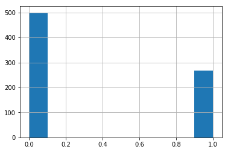

# Gradient Boosting - Lab

## Introduction

In this lab, we'll learn how to use both Adaboost and Gradient Boosting Classifiers from sklearn!

## Objectives

You will be able to:

* Compare and contrast Adaboost and Gradient Boosting
* Use adaboost to make predictions on a dataset
* Use Gradient Boosting to make predictions on a dataset

### Getting Started

In this lab, we'll learn how to use Boosting algorithms to make classifications on the [Pima Indians Dataset](http://ftp.ics.uci.edu/pub/machine-learning-databases/pima-indians-diabetes/pima-indians-diabetes.names). You will find the data stored within the file `pima-indians-diabetes.csv`. Our goal is to use boosting algorithms to classify each person as having or not having diabetes. Let's get started!

We'll begin by importing everything we need for this lab. In the cell below:

* Import `numpy`, `pandas`, and `matplotlib.pyplot`, and set the standard alias for each. Also set matplotlib visualizations to display inline. 
* Set a random seed of `0` by using `np.random.seed(0)`
* Import `train_test_split` and `cross_val_score` from `sklearn.model_selection`
* Import `StandardScaler` from `sklearn.preprocessing`
* Import `AdaboostClassifier` and `GradientBoostingClassifier` from `sklearn.ensemble`
* Import `accuracy_score`, `f1_score`, `confusion_matrix`, and `classification_report` from `sklearn.metrics`


```python
import numpy as np
np.random.seed(0)
import pandas as pd
import matplotlib.pyplot as plt
%matplotlib inline
from sklearn.model_selection import train_test_split, cross_val_score
from sklearn.preprocessing import StandardScaler
from sklearn.ensemble import AdaBoostClassifier, GradientBoostingClassifier
from sklearn.metrics import accuracy_score, f1_score, confusion_matrix, classification_report
```

Now, use pandas to read in the data stored in `pima-indians-diabetes.csv` and store it in a DataFrame. Display the head to inspect the data we've imported and ensure everything loaded correctly. 


```python
df = pd.read_csv('pima-indians-diabetes.csv')
df.head()
```


<div>
<style scoped>
    .dataframe tbody tr th:only-of-type {
        vertical-align: middle;
    }

    .dataframe tbody tr th {
        vertical-align: top;
    }

    .dataframe thead th {
        text-align: right;
    }
</style>
<table border="1" class="dataframe">
  <thead>
    <tr style="text-align: right;">
      <th></th>
      <th>Pregnancies</th>
      <th>Glucose</th>
      <th>BloodPressure</th>
      <th>SkinThickness</th>
      <th>Insulin</th>
      <th>BMI</th>
      <th>DiabetesPedigreeFunction</th>
      <th>Age</th>
      <th>Outcome</th>
    </tr>
  </thead>
  <tbody>
    <tr>
      <th>0</th>
      <td>6</td>
      <td>148</td>
      <td>72</td>
      <td>35</td>
      <td>0</td>
      <td>33.6</td>
      <td>0.627</td>
      <td>50</td>
      <td>1</td>
    </tr>
    <tr>
      <th>1</th>
      <td>1</td>
      <td>85</td>
      <td>66</td>
      <td>29</td>
      <td>0</td>
      <td>26.6</td>
      <td>0.351</td>
      <td>31</td>
      <td>0</td>
    </tr>
    <tr>
      <th>2</th>
      <td>8</td>
      <td>183</td>
      <td>64</td>
      <td>0</td>
      <td>0</td>
      <td>23.3</td>
      <td>0.672</td>
      <td>32</td>
      <td>1</td>
    </tr>
    <tr>
      <th>3</th>
      <td>1</td>
      <td>89</td>
      <td>66</td>
      <td>23</td>
      <td>94</td>
      <td>28.1</td>
      <td>0.167</td>
      <td>21</td>
      <td>0</td>
    </tr>
    <tr>
      <th>4</th>
      <td>0</td>
      <td>137</td>
      <td>40</td>
      <td>35</td>
      <td>168</td>
      <td>43.1</td>
      <td>2.288</td>
      <td>33</td>
      <td>1</td>
    </tr>
  </tbody>
</table>
</div>


### Cleaning, Exploration, and Preprocessing

The target we're trying to predict is the `'Outcome'` column. A `1` denotes a patient with diabetes. 

By now, you're quite familiar with exploring and preprocessing a dataset, so we won't hold your hand for this step. 

In the following cells:

* Store our target column in a separate variable and remove it from the dataset
* Check for null values and deal with them as you see fit (if any exist)
* Check the distribution of our target
* Scale the dataset
* Split the dataset into training and testing sets, with a `test_size` of `0.25`


```python
target = df.Outcome
df.drop('Outcome', axis=1, inplace=True)
```


```python
target.hist()
```


    <matplotlib.axes._subplots.AxesSubplot at 0x2176c94b2e8>





```python
df.isna().sum()
```


    Pregnancies                 0
    Glucose                     0
    BloodPressure               0
    SkinThickness               0
    Insulin                     0
    BMI                         0
    DiabetesPedigreeFunction    0
    Age                         0
    dtype: int64


```python
scaler = StandardScaler()
scaled_df = pd.DataFrame(scaler.fit_transform(df), columns=df.columns)
scaled_df.head()
```

    C:\Users\medio\AppData\Local\Continuum\anaconda3\lib\site-packages\sklearn\preprocessing\data.py:625: DataConversionWarning: Data with input dtype int64, float64 were all converted to float64 by StandardScaler.
      return self.partial_fit(X, y)
    C:\Users\medio\AppData\Local\Continuum\anaconda3\lib\site-packages\sklearn\base.py:462: DataConversionWarning: Data with input dtype int64, float64 were all converted to float64 by StandardScaler.
      return self.fit(X, **fit_params).transform(X)
    


<div>
<style scoped>
    .dataframe tbody tr th:only-of-type {
        vertical-align: middle;
    }

    .dataframe tbody tr th {
        vertical-align: top;
    }

    .dataframe thead th {
        text-align: right;
    }
</style>
<table border="1" class="dataframe">
  <thead>
    <tr style="text-align: right;">
      <th></th>
      <th>Pregnancies</th>
      <th>Glucose</th>
      <th>BloodPressure</th>
      <th>SkinThickness</th>
      <th>Insulin</th>
      <th>BMI</th>
      <th>DiabetesPedigreeFunction</th>
      <th>Age</th>
    </tr>
  </thead>
  <tbody>
    <tr>
      <th>0</th>
      <td>0.639947</td>
      <td>0.848324</td>
      <td>0.149641</td>
      <td>0.907270</td>
      <td>-0.692891</td>
      <td>0.204013</td>
      <td>0.468492</td>
      <td>1.425995</td>
    </tr>
    <tr>
      <th>1</th>
      <td>-0.844885</td>
      <td>-1.123396</td>
      <td>-0.160546</td>
      <td>0.530902</td>
      <td>-0.692891</td>
      <td>-0.684422</td>
      <td>-0.365061</td>
      <td>-0.190672</td>
    </tr>
    <tr>
      <th>2</th>
      <td>1.233880</td>
      <td>1.943724</td>
      <td>-0.263941</td>
      <td>-1.288212</td>
      <td>-0.692891</td>
      <td>-1.103255</td>
      <td>0.604397</td>
      <td>-0.105584</td>
    </tr>
    <tr>
      <th>3</th>
      <td>-0.844885</td>
      <td>-0.998208</td>
      <td>-0.160546</td>
      <td>0.154533</td>
      <td>0.123302</td>
      <td>-0.494043</td>
      <td>-0.920763</td>
      <td>-1.041549</td>
    </tr>
    <tr>
      <th>4</th>
      <td>-1.141852</td>
      <td>0.504055</td>
      <td>-1.504687</td>
      <td>0.907270</td>
      <td>0.765836</td>
      <td>1.409746</td>
      <td>5.484909</td>
      <td>-0.020496</td>
    </tr>
  </tbody>
</table>
</div>


```python
X_train, X_test, y_train, y_test = train_test_split(scaled_df, target, test_size=0.25)
```

### Training the Models

Now that we've cleaned and preprocessed our dataset, we're ready to fit some models!

In the cell below:

* Create an `AdaBoostClassifier`
* Create a `GradientBoostingClassifer`


```python
adaboost_clf = AdaBoostClassifier()
gbt_clf = GradientBoostingClassifier()
```

Now, train each of the classifiers using the training data.


```python
adaboost_clf.fit(X_train, y_train)
```


    AdaBoostClassifier(algorithm='SAMME.R', base_estimator=None,
              learning_rate=1.0, n_estimators=50, random_state=None)


```python
gbt_clf.fit(X_train, y_train)
```


    GradientBoostingClassifier(criterion='friedman_mse', init=None,
                  learning_rate=0.1, loss='deviance', max_depth=3,
                  max_features=None, max_leaf_nodes=None,
                  min_impurity_decrease=0.0, min_impurity_split=None,
                  min_samples_leaf=1, min_samples_split=2,
                  min_weight_fraction_leaf=0.0, n_estimators=100,
                  n_iter_no_change=None, presort='auto', random_state=None,
                  subsample=1.0, tol=0.0001, validation_fraction=0.1,
                  verbose=0, warm_start=False)


Now, let's create some predictions using each model so that we can calculate the training and testing accuracy for each.


```python
adaboost_train_preds = adaboost_clf.predict(X_train)
adaboost_test_preds = adaboost_clf.predict(X_test)
gbt_clf_train_preds = gbt_clf.predict(X_train)
gbt_clf_test_preds = gbt_clf.predict(X_test)
```

Now, complete the following function and use it to calculate the training and testing accuracy and f1-score for each model. 


```python
def display_acc_and_f1_score(true, preds, model_name):
    acc = accuracy_score(true, preds)
    f1 = f1_score(true, preds)
    print("Model: {}".format(model_name))
    print("Accuracy: {}".format(acc))
    print("F1-Score: {}".format(f1))
    
print("Training Metrics")
display_acc_and_f1_score(y_train, adaboost_train_preds, model_name='AdaBoost')
print("")
display_acc_and_f1_score(y_train, gbt_clf_train_preds, model_name='Gradient Boosted Trees')
print("")
print("Testing Metrics")
display_acc_and_f1_score(y_test, adaboost_test_preds, model_name='AdaBoost')
print("")
display_acc_and_f1_score(y_test, gbt_clf_test_preds, model_name='Gradient Boosted Trees')
```

    Training Metrics
    Model: AdaBoost
    Accuracy: 0.8229166666666666
    F1-Score: 0.7424242424242425
    
    Model: Gradient Boosted Trees
    Accuracy: 0.9322916666666666
    F1-Score: 0.9007633587786259
    
    Testing Metrics
    Model: AdaBoost
    Accuracy: 0.7864583333333334
    F1-Score: 0.6554621848739496
    
    Model: Gradient Boosted Trees
    Accuracy: 0.8125
    F1-Score: 0.6727272727272728
    

Let's go one step further and create a confusion matrix and classification report for each. Do so in the cell below.


```python
adaboost_confusion_matrix = confusion_matrix(y_test, adaboost_test_preds)
adaboost_confusion_matrix
```


    array([[112,  18],
           [ 23,  39]], dtype=int64)


```python
gbt_confusion_matrix = confusion_matrix(y_test, gbt_clf_test_preds)
gbt_confusion_matrix
```


    array([[119,  11],
           [ 25,  37]], dtype=int64)


```python
adaboost_classification_report = classification_report(y_test, adaboost_test_preds)
print(adaboost_classification_report)
```

                  precision    recall  f1-score   support
    
               0       0.83      0.86      0.85       130
               1       0.68      0.63      0.66        62
    
       micro avg       0.79      0.79      0.79       192
       macro avg       0.76      0.75      0.75       192
    weighted avg       0.78      0.79      0.78       192
    
    


```python
gbt_classification_report = classification_report(y_test, gbt_clf_test_preds)
print(gbt_classification_report)
```

                  precision    recall  f1-score   support
    
               0       0.83      0.92      0.87       130
               1       0.77      0.60      0.67        62
    
       micro avg       0.81      0.81      0.81       192
       macro avg       0.80      0.76      0.77       192
    weighted avg       0.81      0.81      0.81       192
    
    

**_Question:_** How did the models perform? Interpret the evaluation metrics above to answer this question.

Write your answer below this line:
_______________________________________________________________________________________________________________________________

 
 
As a final performance check, let's calculate the `cross_val_score` for each model! Do so now in the cells below. 

Recall that to compute the cross validation score, we need to pass in:

* a classifier
* All training Data
* All labels
* The number of folds we want in our cross validation score. 

Since we're computing cross validation score, we'll want to pass in the entire (scaled) dataset, as well as all of the labels. We don't need to give it data that has been split into training and testing sets because it will handle this step during the cross validation. 

In the cells below, compute the cross validation score for each model. For the data, use our `scaled_df` variable. The corresponding labels are in the variable `target`. Also set `cv=5`.


```python
print('Mean Adaboost Cross-Val Score (k=5):')
print(cross_val_score(adaboost_clf, scaled_df, target, cv=5).mean())
# Expected Output: 0.7631270690094218
```

    Mean Adaboost Cross-Val Score (k=5):
    0.7631270690094218
    


```python
print('Mean GBT Cross-Val Score (k=5):')
print(cross_val_score(gbt_clf, scaled_df, target, cv=5).mean())
# Expected Output: 0.7591715474068416
```

    Mean GBT Cross-Val Score (k=5):
    0.7591715474068416
    

These models didn't do poorly, but we could probably do a bit better by tuning some of the important parameters such as the **_Learning Rate_**. 
